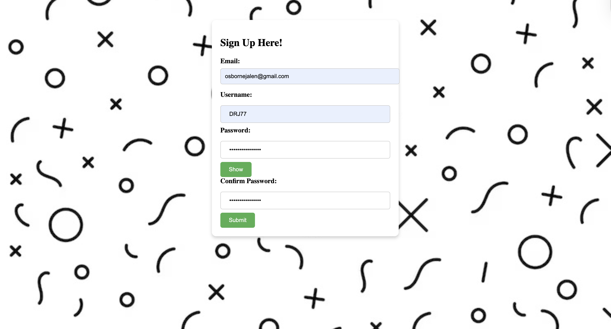
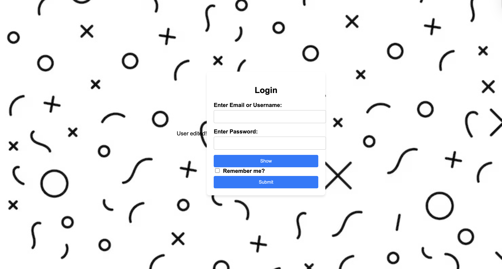
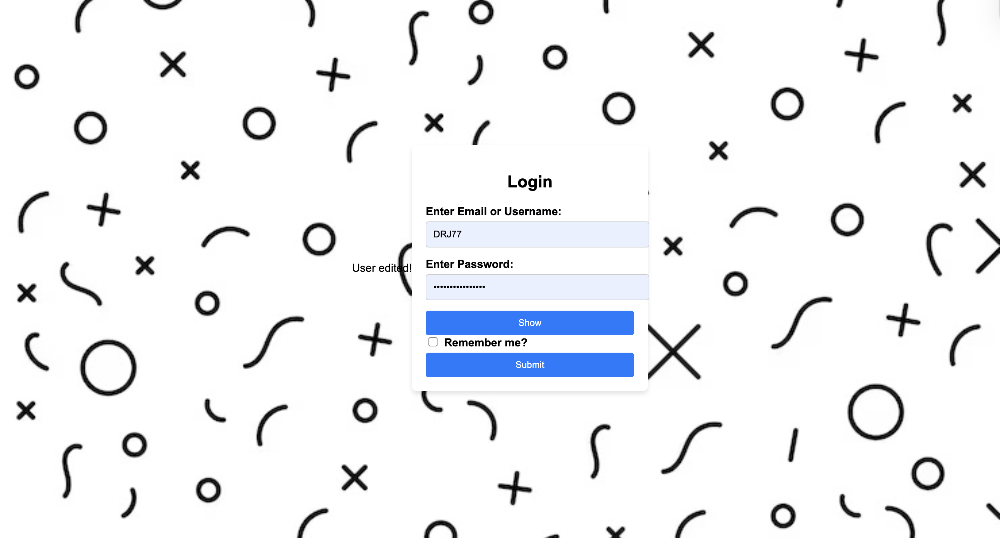
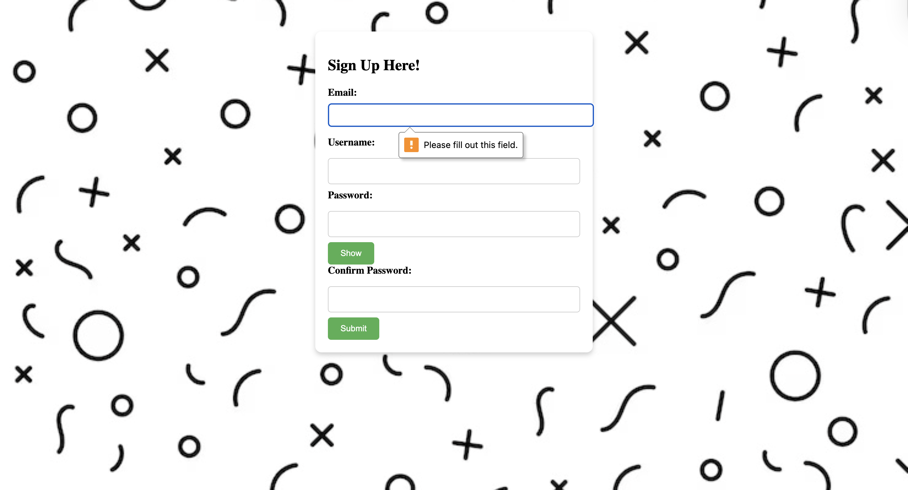
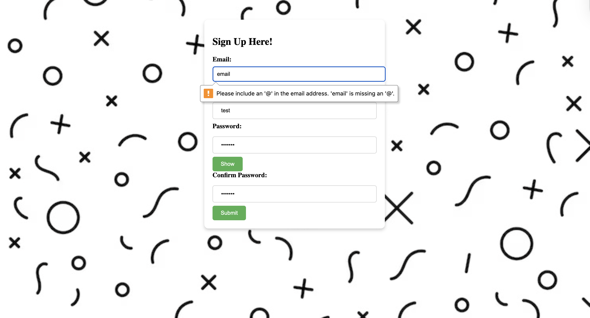
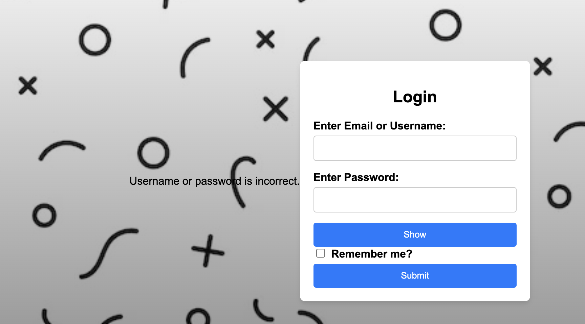
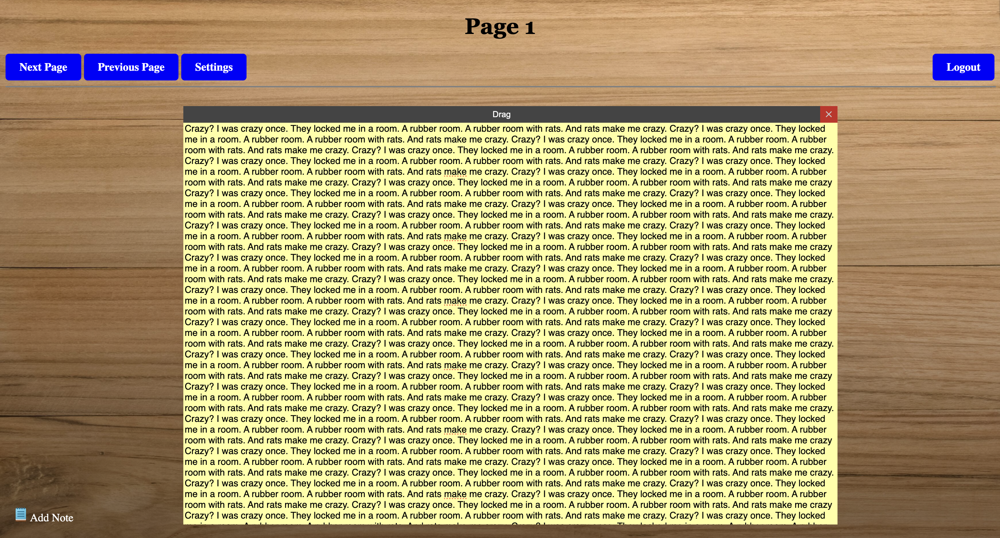

# DoodleDeskSE415

Software Engineering II. Notetaking app group project.
## Table of contents
* [About](#About)
* [Technologies](#Technologies)
* [Setup](#Setup)
* [Features](#Features)
* [Status](#Status)
* [Sources](#Sources)
* [Test cases](#Test-cases)
* [Other info](#Other-info)

## About
A notes app that allows users to fully customize the way their notes look and feel. Users will be able to login and then be redirected to their homepage. 
Users will be able to create multiple “sticky notes” where they can type, draw, or paste photos into. Users will be able to connect these notes, highlight them, change their size, and many other customization options.

## Technologies
Project is created with:\
HTML\
CSS \
PHP \
Hack \
Java Script

## Setup
To run this project...
- Download the DoodleDesk zip file
- Download XAMPP, an open-source software package
- Unzip DoodleDesk and rename the folder to "DD"
- In the XAMPP manager, go to applications folder and place the DD file in the htdocs folder
- In manager, go to manage servers and start Apche Web Server and My SQL Database
- once they're running, open your browser and type localhost/phpmyadmin and hit enter
- once there, copy and paste schema.sql(located in the DD folder) into the sql tab and run it
- open a new tab and type localhost/DD and you should be brought to the front page 

## Features
- User Login & Sign up
- Interactive GUI
- Homepage
- Basic Note Features
- Notes Customization

## Status
Demo coming soon!

## Sources
### Login & Sign Up
- GeeksforGeeks
- W3Schools

## Test cases
### Test Case 1: Authentication (Login/Signup)
T-001\
Valid Input: User signs up with a valid email, username, and password.\
Expected Result: account is successfully created, and the user is redirected to the login page\
Actual Result:

Status: PASS

T-002\
Valid Input: User logs in with correct credentials.\
Expected Result: User is redirected to the notes page.\
Actual Result:

Status: PASS

T-003\
Invalid Input: User submits empty fields for signup.\
Expected result: Error message is displayed, site does not redirect.\
Actual result:

Status: PASS

T-004\
Invalid Input: User entered an invalid email.\
Expected result: email rejected.\
Actual result: 

Status: PASS

T-005\
Invalid Input: User enters the wrong password.\
Expected result: Error shown.\
Actual result: 

Status: PASS

T-006
Invalid Input: User enters the wrong password.\
Expected result: Error shown.\
Actual result: 

Status: PASS

### Test Case 2: Notes Functionality
T-007\
Valid Case: User can add and delete notes.\
Expected result: user clicks add note and a note appears.\
Actual Result: 

Status: PASS

T-008\
Valid Case: User creates multiple notes.\
Expected result: multiple notes display correctly.\
Actual result:

Status: PASS

T-009\
Valid Case: User creates a very long note.\
Expected result: Note created without UI break.\
Actual Result:

Status: PASS

### Test Case 3: Navigation Tests
T-010\
Valid Case: Navigation throughout pages.\
Expected result: notes are saved throughout different pages.\
Actual Result: 

Status: PASS

T-011\
Valid Case: Search navigation.\
Expected Result: User uses the search bar to navigate note pages.\
Actutal result:

Status: PASS

## Other Info
Contact the team here!\
Jalen Osborne - osbornej2@montclair.edu\
Nick Melillo - melillon1@montclair.edu\
Sam Patuto - patutos1@montclair.edu\
Alex Kovatchev - kovatcheva1@montclair.edu
