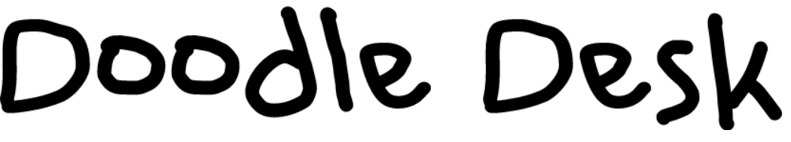
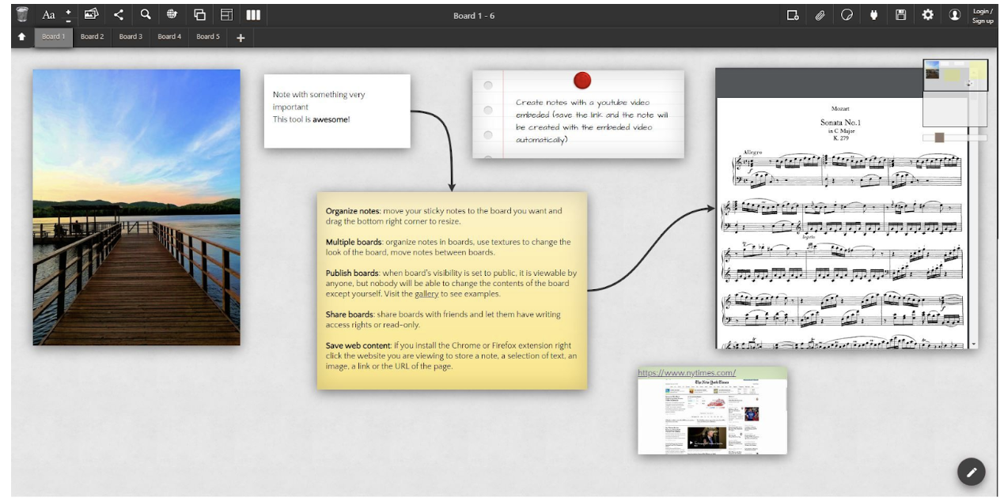
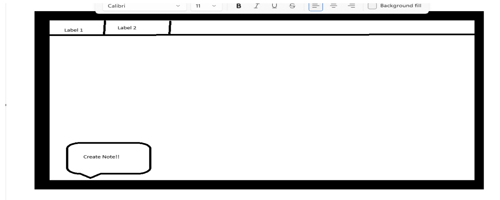

# DoodleDeskSE415

Software Engineering II. Notetaking app group project.
## Table of contents
* [About](#About)
* [Technologies](#Technologies)
* [Setup](#Setup)
* [Features](#Features)
* [Status](#Status)
* [Sources](#Sources)
* [Screenshots](#Screenshots)
* [Other info](#Other-info)

## About
A notes app that allows users to fully customize the way their notes look and feel. Users will be able to login and then be redirected to their homepage. 
Users will be able to create multiple “sticky notes” where they can type, draw, or paste photos into. Users will be able to connect these notes, highlight them, change their size, and many other customization options.

## Technologies
Project is created with:\
HTML\
CSS

## Setup
To run this project...
```

```

## Features
- User Login
- Interactive GUI
- Homepage
### To Do:
- Database
- Basic note features

## Status
In Development

## Sources
...

## Screenshots
### Mockup



## Other Info
Contact the team here!\
Jalen Osborne - osbornej2@montclair.edu\
Nick Melillo - melillon1@montclair.edu\
Sam Patuto - patutos1@montclair.edu\
Alex Kovatchev - kovetcheva1@montclair.edu
